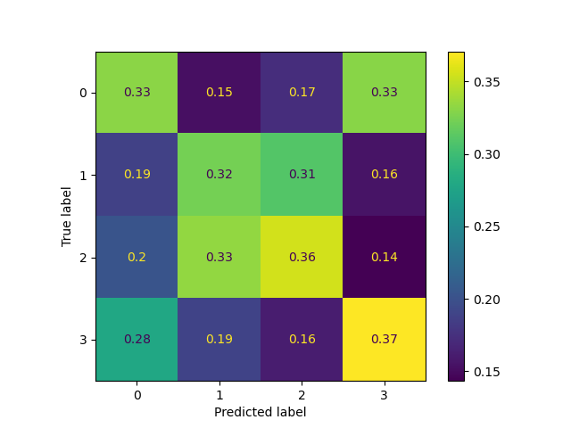

# ma_crossover

A simple repo of code to investigate the tuning of a simple two-moving-average crossover trading technique (no $1,000,000 groundbreaking methods!). This has mainly used to develop my understanding of trading and machine learning (e.g. ANNs and genetic algorithms).

This repo includes:
- A dashboard to run a moving average crossover strategy (given a ticker + parameters), view the strategy stats, and plot the candlestick charts for the trades made.
- A neural network to try and learn when a given crossover strategy will work/fail (this avenue does not appear promising)
- A genetic algorithm to tune the hyperparameters on a select of tickers.

## The trading approach
Simply put, if a faster moving average crosses a slower one from underneath, that's the buy signal. You remain in the trade until either the profit target/stop loss is hit, or the trade is held for a maximum allowed days where you exit on the next days open.

## Before using any of the tools
1. Download the relevent requirements from the "requriements.txt" file (**TO DO**) 
2. Download daily ticker price data using the `get_ticker_data`, which grants the user the options:
    - To download the s&p500 ticker data
    - Download all tickers in the "tickers.csv" file. More can be added to this file, however three are included as standard. **Please make sure there is a single column with the header `ticker` in this csv file.**

## The dashboard
The dashboard can be from the anaconda prompt (cd'd into the directory of the repo) using the command `streamlit run strategy_dash.py`. The dashboard requries the ticker data to be available for the ticker selected. Controllable parameters are on the left-hand-side of the dashboard, outputs from the strategy and a candlestick chart for each trade is given on the right-hand-side. Here is how the dash should look once rendered:

## The neural network
The principle idea behind the nn approach is to learn the trading set-ups where the moving average crossover strategy will work. So rather than predicting raw price increases, the aim is to use a NN to notice patterns where a trading strategy works. The motivation for this is to emulate a trader learning the environments on where a strategy works or doesn't. **Currently, this is not proving to be a viable route**, better feature engineering may be required, or, the problem may not be tractable at all! Here is the confusion matrix for a bidirectional LSTM network run for 15 epochs.

It's learned **something**, but clearly this isn't much better than randomly guessing... If someone smarter than me (not hard) improves this code, please let me know! I believe this may not work because of the following reasons:
1. **Limited data**: Perhaps a moving average trader considers the general market (e.g. S&P500 as a whole) to make a decision, or perhaps additional confirmation is needed from sentiment analysis.
2. **Incorrect features**: Simple correlation tests say that prices are not a good indicator of future returns. It's likely that better feature engineering is required rather than simply adding in OLHC + volume.
3. **Too random**: It's likely the input data is far too random so the NN cannot generalise. Perhaps more work is requried to further limit the cases that the NN sees, maybe only feeding it in bull/bear markets is better.

### To use
1. Configure and run `get_nn_input.py`, which generates a .csv file containing the input training data to the nn.
2. Configure and run `train_nn.py`. This will train and save the nn model. 
**NOTE**: Class label 0 = stop loss hit, class label 1 = max holding days passed, class label 2 = profit target hit.

## The genetic algorithm
The ga has been used to tune the hyperparameters controlling the moving average strategy. These are as follows:
1. Fast/slow moving average type (rolling or exponential)
2. Number of days for the moving averages
3. Profit target/stop loss
4. Number of days to remain in the trade at maximum
The principle here is to try (witout curve fitting) to find an optimal moving average strategy that can be used on the general market. We are after high win-rate and/or high-profit strategies, which forms the fitness function that the genetic algorithm attempts to maximise. In short, a random selection of tickers is chosen and the genetic algorithm maximises the strategy for those tickers; this is then confirmed or denied with an out of sample test which performs the same strategy on tickers the genetic algorithm did not see.

### Limitations
1. **Curve fitting**: Genetic algorithms are prone to curve fitting and producing excellent results for a set of tickers, and performing poorly in the out of sample test. This can be fixed with larger amounts of tickers to train on (slow), or imposing tight restrictions by only considering strategies which perform a high amount of trades per ticker.
2. **Slow**: Machine learning in general is quite slow, but I have personally found this genetic algorithm to be fairly demanding on my low-end laptop. It is likely that this code can be written more optimally, and is something I would consider if further research reveals this is a good way to develop new strategies for the markets.

### How to use
1. Configure and run `run_genetic_algo.py`

And that's it! The outcome of the optimiser, as well as the results from the in/out of sample testing is printed to the IPython display. For convenience, the optimised strategy is saved as a dictionary in the ga folder and can be loaded using `pickle`.

## Some notes
1. The buying/selling algorithm has been compiled with `numba`. There is likely an efficient pandas approach to doing this, however, once the numba code has been compiled it is remarkably efficient.
2. This approach may be extendable (and perform better) with other trading strategies, this is future work and hasn't been attempted yet.
