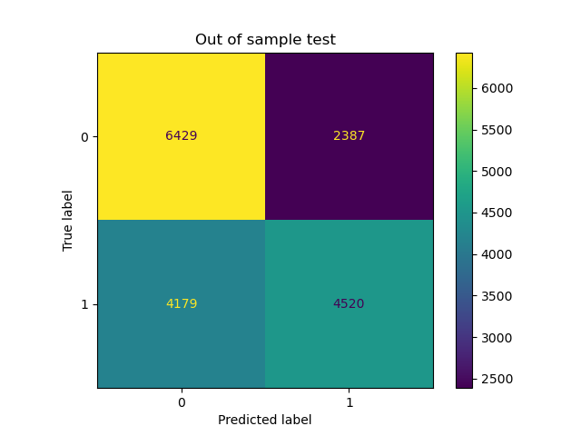

# ma_crossover

A simple repo of python tools to develop and optimise basic trading strategies (no $1m ideas here sorry!). This has mainly been used to develop my understanding into trading methods, and gain more experience with machine learning techniqes (ANNs and genetic algorithms).

This repo includes:
- A dashboard to run a moving average crossover strategy (given a ticker + parameters), view the strategy stats, and plot the candlestick charts for the trades made.
- A neural network to try and learn when a strategy will work/fail.
- A genetic algorithm to tune the hyperparameters of a strategy on a set of tickers.

## Before using any of the tools
1. Download the relevent requirements from the "requriements.txt" file (**TO DO**) 
2. Download daily ticker price data using the `get_ticker_data`, which grants the user the options:
    - To download the s&p500 ticker data
    - Download all tickers in the "tickers.csv" file (located in the `utils/` directory). More can be added to this file, however three are included as standard. **Please make sure there is a single column with the header `ticker` in this csv file.**
3. The stock fundamental data can be downloaded from Alpha vantage, for this you will need to configure `utils/single_scripts/get_fundamentals.py`. It is limited to a download speed of 5 API calls per minute, and a maximum of 500 calls per day. You will also need a free API key for this.

## The strategies implemented

### A simple moving average crossover
This is referred to as `simple ma crossover` in the running of the NN or GA. The rules of this strategy are as follows:
1. Once the faster moving average crosses the faster one from underneath, the stock is bought on the next open.
2. Remain in the trade until either the stop loss is hit, or a alloted number of holding days have passed.

### A simple bollinger band strategy
This is referred to as `simple bollinger band` in the running of the NN or GA. The rules of this strategy are as follows:
1. If the stock closes below the lower band, buy on the next open.
2. Remain in the trade until either the stop loss is hit, or a alloted number of holding days have passed.

### The bollinger squeeze strategy
This is referred to as `bollinger squeeze` in the running of the NN or GA. The rules of this strategy are as follows:
1. If the bollinger bands come within x% of each other, then buy on the next open.
2. Remain in the trade until either the stop loss is hit, or a alloted number of holding days have passed.

## The genetic algorithm
The GA has been used to tune the hyperparameters controlling any implemented strategy. For example:
1. Number of days to use for any moving averages/standard deviations
2. Stop loss
3. Number of days to remain in the trade
The principle here is to try (without curve fitting) to find an optimal strategy that can be used on the general market. We are after high win-rate and/or high-profit strategies, which forms the fitness function that the genetic algorithm attempts to maximise. In short, a random selection of tickers is chosen and the genetic algorithm maximises the strategy for those tickers; this strategy is then confirmed or denied with an out of sample test which performs the same strategy on tickers the genetic algorithm did not see.

### Limitations
1. **Curve fitting**: Genetic algorithms are prone to curve fitting and producing excellent results for a set of tickers, and performing poorly in the out of sample test. This can be fixed with larger amounts of tickers to train on (slow), or imposing tight restrictions by only considering strategies which perform a high amount of trades per ticker.
2. **Slow**: Machine learning in general is quite slow, but I have personally found this genetic algorithm to be fairly demanding on my low-end laptop. It is likely that this code can be written more optimally, and is something I would consider if further research reveals this is a good way to develop new strategies for the markets.

### How to use
1. Configure and run `run_genetic_algo.py`

And that's it! The outcome of the optimiser, as well as the results from the in/out of sample testing is printed to the IPython display. For convenience, the optimised strategy is saved as a dictionary in the ga folder and can be loaded using `pickle`.

## The neural network
The principle idea behind the nn approach is to try and learn the trading set-ups where a specific strategy will work/fail. So rather than predicting price increases, the aim is to use a NN to find patterns where a trading system works. The motivation for this is to emulate a trader learning the environments on where a strategy works or doesn't. Here is the confusion matrix for a bidirectional LSTM network run for 15 epochs on the bollinger squeeze strategy.

It's learned **something**... If someone smarter than me (not hard) improves this code, please let me know! It's likely that better feature engineering, or additional data-sources can enhance the predictive power. Currently, **including the fundamentals does not really help predictions**, this is likely because the trades are too short-scale where the fundamentals are less important. Perhaps for longer trades the fundamentas are more crucial.

### To use
1. Configure the script `nn/strat_configs` to adjust the parameters of a strategy.
2. Configure and run `get_nn_input.py`, which generates a .csv file containing the input training data to the nn.
3. Configure and run `train_nn.py`. This will train and save the nn model. 
**NOTE**: Class label 0/1 = trade is less/more than the average for that strategy. Typically after tuning the hyperparameters, the average will be ~1%. 

## The dashboard
The dashboard is **only implemented for the simple ma crossover**. It can be run from the anaconda prompt (cd into the directory of the repo) using the command `streamlit run strategy_dash.py`. The dashboard requries the ticker data to be available for the ticker selected. Controllable parameters are on the left-hand-side of the dashboard, outputs from the strategy and a candlestick chart for each trade is given on the right-hand-side. Here is how the dash should look once rendered:

## Some notes
1. The buying/selling algorithm has been compiled with `numba`. There is likely an efficient pandas approach to doing this, however, once the numba code has been compiled it is remarkably efficient.
2. This approach may be extendable (and perform better) with additional trading strategies.
3. The longer term trades may be more predictable with the fundamentals, this is a topic for future exploration.
